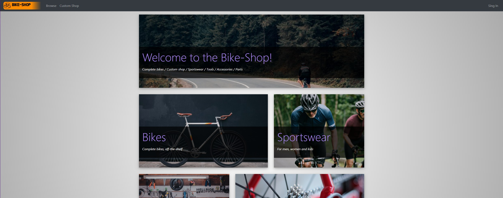
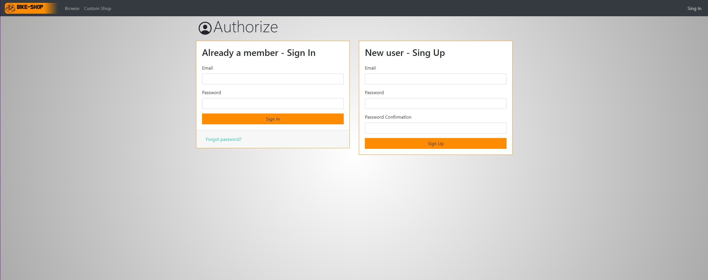
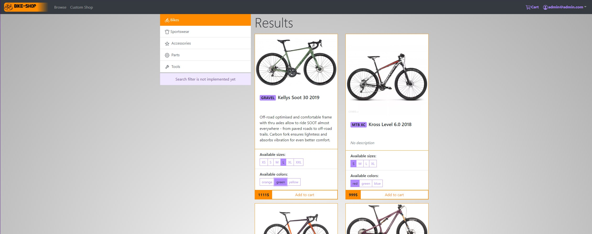

# Bike-Shop

> Demo website for a bike shop

## Table of contents

- [Bike-Shop](#bike-shop)
  - [Table of contents](#table-of-contents)
  - [General info](#general-info)
  - [Demo](#demo)
  - [Screenshots](#screenshots)
  - [Technologies](#technologies)
  - [Features](#features)
  - [Issues](#issues)
  - [Status](#status)
  - [Contact](#contact)

## General info

Simple, fully responsive website for a bike shop with basic Firebase backend (authorization and CRUD).

## Demo

Project is available online on Github Pages [here](https://michaltkacz.github.io/bike-shop/).

## Screenshots

## Technologies

- HTML / CSS / JS
- [React 17.0.2](https://reactjs.org/) library.
- [React Bootstrap v1.5.2](https://react-bootstrap.github.io/) front-end library.
- [Bootstrap v4.6.0](https://getbootstrap.com/) front-end toolkit.
- [Firebase](https://firebase.google.com/) service as backend for authorization and database.
- [Aphrodite](https://github.com/Khan/aphrodite) CSS in JS styling
- [React Icons](https://react-icons.github.io/react-icons/) icons components
- [React Social Icons](https://www.npmjs.com/package/react-social-icons) social icons components

## Features

Currently:

- Mobile and desktop friendly
- Account authorization
- Browsing shop offer
- User's shopping cart

Ideas / Todo:

- Add more database entries
- Implement search filters
- Implement "custom shop"

## Issues

Some optimalizations and code refactor could me made.

## Status

Project will probably be under further development.

## Contact

Created by [@michaltkacz](https://github.com/michaltkacz) - feel free to contact me!
